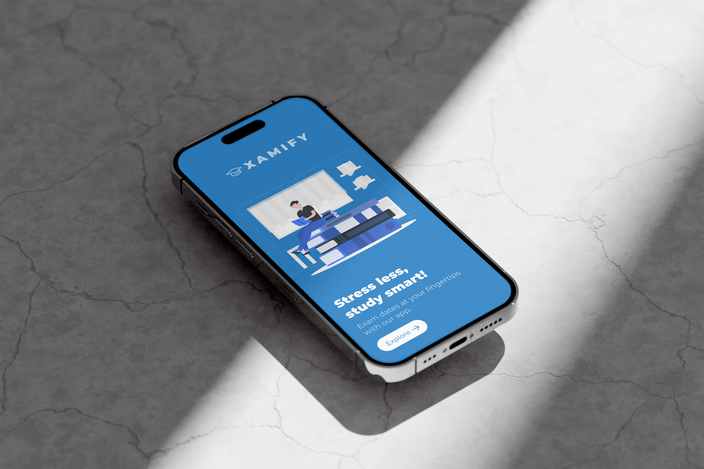

# xamify
Built with Flutter, Xamify is designed to be a one-stop solution for students preparing for public exams in India.

With Xamify, admins can effortlessly add new exams, schedule important notifications, and upload valuable study materials. Students can easily sign up, select their exams, and receive timely updates and study resources.

# Features
- Opt for multiple exams.
- Realtime notifications.
- Study materials for all exams.
- opt out and opt in to an exam at any time

# Installation
- Clone the repository: `git clone https://github.com/adarshcm10/Xamify.git`

- Open the project in your preferred development environment (e.g., Android Studio, Visual Studio Code).

- Build and run the app on your preferred device or emulator.

# Contributing
Contributions are welcome! If you find any issues or want to add new features to the app, feel free to submit a pull request. Please make sure to follow the project's code style and guidelines.

# License
This project is licensed under the MIT License.
